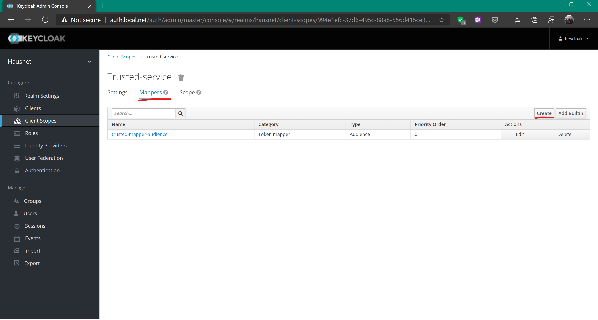

# Kubernetes Cluster for Local Development

This repository contains setup and installation for a local
kubernetes cluster using minikube.

**Table of Contents**
- [Prerequistes](#prerequisites)
  - [Minikube on Windows](#minikube-on-windows)
- [Setting up load balancer](#setting-up-load-balancer)
- [Setting up ingress](#setting-up-ingress)
- [Managing Certificates](#managing-certificates)
  - [Installing cert-manager](#installing-cert-manager)
  - [Creating Certificates](#creating-certificates)
  - [Securing Ingresses](#securing-ingresses)
- [Vault](#vault)
  - [Installing Vault](#installing-vault)
  - [Writing Secrets to Vault](#writing-secrets-to-vault)
  - [Reading Secrets from Vault](#reading-secrets-from-vault)
- [Single-Sign-On](#single-sign-on)
  - [Setting up the Keycloak stack](#setting-up-the-keycloak-stack)
  - [Configuring Keycloak](#configuring-keycloak)
  - [Protecting Resources with Gatekeeper](#protecting-resources-with-gatekeeper)
- [Service Mesh](#service-mesh)
  - [Setting up distributed tracing](#setting-up-distributed-tracing)
- [Serverless With Kubeless](#serverless-with-kubeless)
- [References](#references)

## Prerequisites

1. Install [minikube](https://minikube.sigs.k8s.io/docs/start/)
2. Initialize minikube cluster using VM driver
```
minikube start --driver=<hyperv|virtualbox>
```
3. Install helm

```
$ brew install helm # OSX
$ snap install helm --classic # Linux Debian-based distros with Snapd
\> choco install helm // Windows with chocolatey
```

4. Install vault

```
$ brew install vault # OSX
$ snap install vault --classic # Linux Debian-based distros with Snapd
\> choco install vault // Windows with chocolatey
```

> ⚠ Helm will be auto-configured to use the kubernetes configuration
> that is set up when `minikube start` is run

### Minikube on Windows

If you're using hyperv in Windows to manage minikube,
a script has been provided [minikube-control.ps1](./minikube-control.ps1)
In order to make it easier to run minikube since hyperv requires elevated
privileges.

## Setting up load balancer

In order for ingress to work correctly a load balancer needs to be set
up. The examples in this repository use [MetalLB](https://metallb.universe.tf/installation/)
to create a local Load Balancer. An example configuration can be cound
in this repo at [metallb-configmap.yml](./metallb-configmap.yml).

## Setting up ingress

The recommended ingress for most Kubernetes applications is [ingress-nginx](https://kubernetes.github.io/ingress-nginx/).
ingress-nginx is based on the Nginx http server and proxy and is configurable
through kubernetes metadata annotations (more on that later).

If using MetalLB, you can deploy the ingress-nginx ingress controller with the following commands:

```
# Set up the ingress RBAC
kubectl apply -f https://raw.githubusercontent.com/kubernetes/ingress-nginx/nginx-0.30.0/deploy/static/mandatory.yaml
# Set up the ingress controller
kubectl apply -f https://raw.githubusercontent.com/kubernetes/ingress-nginx/nginx-0.30.0/deploy/static/provider/cloud-generic.yaml
```

Alternatively, the ingress could be controlled using minikube's builtin ingress-nginx

```
minikube addons enable ingress
```

## Managing Certificates

[ cert-manager ](https://cert-manager.io/) is a cloud-native
application which is used to manage and generate secrets for
Kuberetes. cert-manager exposes CustomResourceDefinitions to make
certificate management easier. Multiple certificate issuers are
supported such as Let's Encrypt, self-signed, Certificate Authority
and Vault.

### Installing cert-manager

Cert Manager can be installed using the
[helm chart](https://cert-manager.io/docs/installation/kubernetes/#installing-with-helm).

```
kubectl create namespace cert-manager
helm repo add jetstack https://charts.jetstack.io
helm repo update
helm install cert-manager jetstack/cert-manager --namespace cert-manager --set installCRDs=true
```

An issuer will have to be created in order to start issuing 
certificates. The example below shows how to set a
self-signed ClusterIssuer for development purposes

```yaml
apiVersion: cert-manager.io/v1alpha2
kind: ClusterIssuer
metadata:
  name: selfsigned-issuer
  namespace: cert-manager
spec:
  selfSigned: {}
```

### Creating Certificates

cert-manager defines a CustomResourceDefinition for certificates
Certificates will automatically be generated and signed against
the root certificates stored in the designated issuer.

A certificate definition is defined in the example below:

```yaml
apiVersion: cert-manager.io/v1alpha2
kind: Certificate
metadata:
  name: example-com
spec:
  secretName: example-com-tls
  dnsNames:
    - example.com
    - www.example.com
  issuerRef:
    name: selfsigned-issuer
    # We can reference ClusterIssuers by changing the kind here.
    # The default value is Issuer (i.e. a locally namespaced Issuer)
    kind: ClusterIssuer
```

> ℹ cert-manager will automatically create the certificate
> and store it in the secret designated by the `secretName` key.
> In this case, the key is stored in a secret called `example-com-tls`

### Securing Ingresses

Ingresses can be secured with certificates created with
certificate-manager. After being secured with a certificate, the
ingress will perform automatic TLS redirection.

Securing ingresses can be performed by adding the tls section to
the ingress manfiest. The example uses certificates defined in
the previous examples.

```yaml
apiVersion: extensions/v1beta1
kind: Ingress
metadata:
  annotations:
    # add an annotation indicating the issuer to use.
    cert-manager.io/cluster-issuer: nameOfClusterIssuer
  name: myIngress
  namespace: myIngress
spec:
  rules:
  - host: example.com
    http:
      paths:
      - backend:
          serviceName: myservice
          servicePort: 80
        path: /
  tls: # < placing a host in the TLS config will indicate a certificate should be created
  - hosts:
    - example.com
    secretName: example-com-tls # < cert-manager will store the created certificate in this secret.
```

## Vault

Vault is a key-value store which is intended to store
application secrets. 

### Installing Vault

While there is an
[official helm chart](https://learn.hashicorp.com/vault/getting-started-k8s/minikube)
which can be used to install vault onto a kubernetes cluster,
this tutorial will cover installation of
[bank-vaults](https://github.com/banzaicloud/bank-vaults).
bank-vaults is a project maintained by [ banzaicloud ](https://banzaicloud.com/)
which utilizes Hashicorp Vault for secrets management.
bank-vaults provides webhooks and direct container injection for vault
secrets into Kubernetes pods

Install the helm repo

```
helm repo add banzaicloud-stable https://kubernetes-charts.banzaicloud.com
```

Create the [ vault-infra ](./bank-vaults/vault-infra.yml) namespace.

```
kubectl create -f ./bank-vaults/vault-infra.yml
```

Install the vault-infra chart to the vault-infra namespace

```
helm upgrade --namespace vault-infra --install vault-operator banzaicloud-stable/vault-operator --wait
```

Create the RBAC and Cluster-Roles on the kubernetes cluster:
```
kubectl create -f ./bank-vaults/rbac.yml
kubectl create -f ./bank-vaults/cr.yml
```

Install the webhook

```
helm upgrade --namespace vault-infra --install vault-secrets-webhook banzaicloud-stable/vault-secrets-webhook --wait
```

#### bank-vaults Helm Chart Notes

By default the following options are enabled on vault when the helm chart is installed:
- Kubernetes authentication (being able to authenticate to vault with a 
[Kubernetes service account](https://kubernetes.io/docs/tasks/configure-pod-container/configure-service-account/) )
- PKI

### Writing secrets to vault

Get the unseal key from vault

```sh
export VAULT_TOKEN=$(kubectl get secrets vault-unseal-keys -o jsonpath={.data.vault.root} | base64 --decode)
```

> ⚠ Windows users will have to do the following due to base64 not having a Windows equivalent
>
> ```ps1
> kubectl get secrets vault-unseal-keys -o jsonpath="{data.vault-root}" > secrets.txt
> certutil -decode .\secrets.txt .\decrypted.txt
> $Env:VAULT_TOKEN=(cat decrypted.txt)
> ```

Get the ca certificate from Kubernetes

```sh
kubectl get secret vault-tls -o jsonpath="{.data.ca\.crt}" | base64 --decode > $PWD/vault-ca.crt
export VAULT_CACERT=$PWD/vault-ca.crt
```

> ⚠ Windows users will have to do the following due to base64 not having a Windows equivalent
>
> ```ps1
> kubectl get secret vault-tls -o jsonpath="{.data.ca\.crt}" > vault-ca.encrypted.crt
> certutil -decode .\vault.ca.encrypted.crt .\vault-ca.crt
> $Env:VAULT_CACERT=$PWD\vault-ca.crt
> ```

Expose the vault endpoint

```
kubectl port-forward service/vault 8200 &
```

Set the vault endpoint as an environment variable

```
export VAULT_ADDR=https://127.0.0.1:8200 # Linux/OSX
$Env:VAULT_ADDR="https://127.0.0.1:8200" // Windows - Powershell
```

Write secrets to vault

```
vault kv put secret/path/to/your/secret key=value
```

### Reading Secrets from Vault

Secrets can be injected into Kubernetes Deployments at runtime by adding annotations
and setting environment variables in the manifest file.

```yaml
apiVersion: apps/v1
kind: Deployment
metadata:
  name: hello-secrets
spec:
  replicas: 1
  selector:
    matchLabels:
      app: hello-secrets
  template:
    metadata:
      labels:
        app: hello-secrets
      annotations:
        vault.security.banzaicloud.io/vault-addr: "https://vault:8200"
        vault.security.banzaicloud.io/vault-tls-secret: "vault-tls"
    spec:
      serviceAccountName: default
      containers:
      - name: alpine
        image: alpine
        command: ["sh", "-c", "echo $AWS_SECRET_ACCESS_KEY && echo going to sleep... && sleep 10000"]
        env:
        - name: AWS_SECRET_ACCESS_KEY
          value: "vault:secret/data/path/to/your/secret#secret_key"
```

On your local machine, the `vault` command can be used

```
vault kv get /path/to/your/secret
```

> ⚠ The vault webhook is very finnicky about how it parses vault secret tokens
> Names should only have alphanumeric characters and underscores (_).
> I've tried to create secrets with periods (.) in the keys and they wouldn't populate
> in the container.
> ```
> vault:secret/data/[path]#[key]
> ```

> ⚠ Only deploy rbac and cr yaml files to the default namespace.
> Attempting to start any of these services to other namespaces causes them to
> not create vault pods which are used to store secrets

Secrets stored in environment variables will not show up using `kubectl exec`.
The secret values are substituted during container runtime using a sidecar pod
`vault-env`.

> ⚠ When injecting Vault secrets into a Kubernetes Secret, the annotations
> `vault.security.banzaicloud.io/vault-path: "kubernetes"` and
> `vault.security.banzaicloud.io/vault-skip-verify: "true"` will have to be added.
> Using TLS to request secrets times out and the pod attempts to resolve the
> secret which causes problems when the application tries to run.

## Single-Sign-On

Single Sign On (SSO) in this cluster is managed with [Keycloak](keycloak.org).
Keycloak is an identity management service which is sponsored by RedHat and powered
by JBoss. Keycloak is well-documented and has ready-made containers for a Kubernetes
Cluster. Keycloak also supports Vault-based authentication.

### Setting up the Keycloak Stack

There are two components to the Keycloak stack: A database, and the Keycloak application.
For the database, this example will utilize Postgres due to its performance and its reliability.

Postgres is is intended to be installed using the
[helm chart](https://github.com/bitnami/charts/tree/master/bitnami/postgresql).

```bash
helm repo add bitnami https://charts.bitnami.com/bitnami
```

Helm allows supplying arguments using variables files.
There is a [variables file](./postgres-values.yml) prepared
which contains configuration to set the Postgres username and password
using Vault secrets and annotates the deployment using bank-vaults annotations.

Installation of the chart can be handled by creating the Keycloak namespace and
running `helm install`.

```bash
kubectl create ns keycloak
helm install --namespace keycloak db bitnami/postgresql -f ./keycloak-values.yml
```

After running Helm, the Postgresql will be installed an running on the cluster.

> ⚠ When running Keycloak using the `bank-vaults` annotations, the Keycloak server
> may fail to initialize due to the vault services not being set up before Keycloak
> attempts to start.
>
> Delete the `vault-tls` secret from the `keycloak` namespace
>
> ```
> kubectl delete secret vault-tls -n keycloak
> ```
>
> Delete the pods from the `keycloak` namespace
>
> ```
> kubectl delete po db_postgresql_0 -n keycloak
> kubectl delete po keycloak -n keycloak
> ```
>
> Since the pods are managed by the deployment, Kubernetes will automatically bring
> up new pods. The pods will start. The data is persisted on PersistentVolumes so
> they will not be deleted.

[keycloak.yml](./keycloak.yml) contains a kubernetes manifest which can be used to
create the keycloak application deployment and service.

```bash
kubectl create -f keycloak.yml
```

[keycloak-ingress.yml](./keycloak-ingress.yml) creates the Kubernetes ingress object
which can be used to access the keycloak application deployment from outside the 
Kubernetes cluster.

```bash
kubectl create -f keycloak-ingress.yml
```

At this point, a Keycloak stack should be deployed and Keycloak can be accessed through a
web browser (startup time typically takes about a minute).


### Configuring Keycloak

In order to use Keycloak's SSO features, an OpenID-Connect Realm will need to be set up


A client needs to be created in the realm


Give the client a name and set the following values:

| Setting               | Value                                                            |
|-----------------------|------------------------------------------------------------------|
| Access Type           | Confidential                                                     |
| Authorization Enabled | ON                                                               |
| Valid Redirect URIs   | http:// URL where you want Keycloak to redirect to after sign-on |

Once the client is created, a Client Scope needs to be created


Give the client scope a name, save it, and select the _Mappers_ tab.
Create a new mapper



Select the following values for the mapper:

| Setting                  | Value                                 |
|--------------------------|---------------------------------------|
| Mapper Type              | Audience                              |
| Included Client Audience | Client you created in a previous step |

Go back into the client created earlier and set add the new scope to the default scopes for the
client.


### Protecting Resources with Gatekeeper

The Keycloak project provides a proxy service which will require users to sign on using
Keycloak before attempting to access the site. The proxy service is called
[Keycloak Gatekeeper](https://www.keycloak.org/docs/latest/securing_apps/#_keycloak_generic_adapter).

[linkerd-gatekeeper.yml](./linkerd-gatekeeper.yml) provides an example of how to secure
ingresses using Keycloak Gatekeeper. The realm and client in use by keycloak-gatekeeper were
set up during the previous section.

An encryption key can be generated by the following command:

```bash
cat /proc/sys/kernel/random/uuid | sed 's/-//g'
```

> ⚠ Proxy configuration can be impacted by the following Nginx annotations
> ```yaml
> nginx.ingress.kubernetes.io/upstream-vhost: $service_name.$namespace.svc.cluster.local:port
>     nginx.ingress.kubernetes.io/configuration-snippet: |
>       proxy_set_header Origin "";
>       proxy_hide_header l5d-remote-ip;
>       proxy_hide_header l5d-server-id;
> ```
>
> When I added these annotations, I got stuck in an infinite redirect loop

## Service Mesh

A service mesh is an infrastructure layer for making service-to-service communication
secure, fast, and reliable. Service meshes provide runtime debugging and observability.

This cluster was set up using [Linkerd](https://linkerd.io/2/overview/).
Follow the [linkerd install instructions](https://linkerd.io/2/getting-started/#step-1-install-the-cli).

Install the linkerd mesh with the following command.

```
linkerd install | kubectl apply -f -
```

To use Linkerd with applications, you can add the linkerd inject
annotation to either a `namespace` or a `deployment`.

```yaml
apiVersion: v1
kind: Namespace
metadata:
  name: my-namespace
  annotations:
    linkerd.io/inject: enabled
```

```yaml
apiVersion: apps/v1
kind: Deployment
metadata:
  name: my-deployment
  matchLabels:
    app: my-deployment
spec:
  template:
    metadata:
      annotations:
        linkerd.io/inject: enabled
      labels:
        app: my-deployment
    spec:
      ...
```

Linkerd also supports injecting through the Linkerd CLI.

```
linkerd inject my-deployment.yaml | kubectl create -f -
```

To use linkerd with Ingress, the following annotation needs
to be added to the Ingress:

```yaml
nginx.ingress.kubernetes.io/configuration-snippet: |
  proxy_set_header l5d-dst-override $service_name.$namespace.svc.cluster.local:$service_port;
  grpc_set_header l5d-dst-override $service_name.$namespace.svc.cluster.local:$service_port;
```

### Setting up distributed tracing

1. Install the collector
```
kubectl apply -f https://run.linkerd.io/tracing/collector.yml
```
2. Install [Jaeger](https://www.jaegertracing.io/)
```
kubectl apply -f https://run.linkerd.io/tracing/backend.yml
```

## Serverless With Kubeless

Kubeless is a serverless framework which allows you to deploy
serverless functions onto a Kubernetes cluster using Kubernetes
Custom Resource Definitions.

To install Kubeless, use the Kubeless manifests

```
export RELEASE=$(curl -s https://api.github.com/repos/kubeless/kubeless/releases/latest | grep tag_name | cut -d '"' -f 4)
kubectl create ns kubeless
kubectl create -f https://github.com/kubeless/kubeless/releases/download/$RELEASE/kubeless-$RELEASE.yaml
```

Kubeless also has a UI which can be installed by using the kubernetes
manifest

```
kubectl create -f https://raw.githubusercontent.com/kubeless/kubeless-ui/master/k8s.yaml
```

A [serverless plugin](https://www.serverless.com/framework/docs/providers/kubeless/guide/intro/) for kubeless can help with deploying
functions to Kubernetes


# References
- Kubernetes ConfigMap Syntax [https://kubernetes.io/docs/tasks/configure-pod-container/configure-pod-configmap/](https://kubernetes.io/docs/tasks/configure-pod-container/configure-pod-configmap/)
- Kubernetes Secret Syntax [https://kubernetes.io/docs/concepts/configuration/secret/](https://kubernetes.io/docs/concepts/configuration/secret/)
- Kubernetes Deployment Syntax [https://kubernetes.io/docs/concepts/workloads/controllers/deployment/](https://kubernetes.io/docs/concepts/workloads/controllers/deployment/)
- Kubernetes Service Syntax [https://kubernetes.io/docs/concepts/services-networking/service/](https://kubernetes.io/docs/concepts/services-networking/service/)
- Kubernetes Ingress Syntax [https://kubernetes.io/docs/concepts/services-networking/ingress/](https://kubernetes.io/docs/concepts/services-networking/ingress/)
- Minikube [https://minikube.sigs.k8s.io/docs/](https://minikube.sigs.k8s.io/docs/)
- MetalLb [https://metallb.universe.tf](https://metallb.universe.tf)
- ingress-nginx [https://kubernetes.github.io/ingress-nginx/](https://kubernetes.github.io/ingress-nginx/)
- Linkerd docs [https://linkerd.io/2/](https://linkerd.io/2/)
- Cert-Manager docs [https://cert-manager.io/docs/](https://cert-manager.io/docs/)
- Consul Reference [https://www.consul.io/docs/platform/k8s/](https://www.consul.io/docs/platform/k8s/)
- Vault Reference [https://learn.hashicorp.com/vault?track=getting-started-k8s#getting-started-k8s](https://learn.hashicorp.com/vault?track=getting-started-k8s#getting-started-k8s)
- Injecting Vault Secrets Via Sidecar [https://learn.hashicorp.com/vault/getting-started-k8s/sidecar](https://learn.hashicorp.com/vault/getting-started-k8s/sidecar)
- Vault Agent Sidecar Injector Docs [https://www.vaultproject.io/docs/platform/k8s/injector](https://www.vaultproject.io/docs/platform/k8s/injector)
- Inject Secrets Into Pods [https://banzaicloud.com/blog/inject-secrets-into-pods-vault-revisited/](https://banzaicloud.com/blog/inject-secrets-into-pods-vault-revisited/)
- bank-vaults Operator Helm chart [https://github.com/banzaicloud/bank-vaults/tree/master/charts/vault](https://github.com/banzaicloud/bank-vaults/tree/master/charts/vault)
- Vault Webhook with Consul Template [https://banzaicloud.com/blog/vault-webhook-consul-template/](https://banzaicloud.com/blog/vault-webhook-consul-template/)
- Mutating Webhook [https://banzaicloud.com/docs/bank-vaults/mutating-webhook/](https://banzaicloud.com/docs/bank-vaults/mutating-webhook/)
- Backing up Vault with [Velero](https://velero.io/) [https://banzaicloud.com/docs/bank-vaults/backup/](https://banzaicloud.com/docs/bank-vaults/backup/)
- Keycloak Docker page [https://registry.hub.docker.com/r/jboss/keycloak](https://registry.hub.docker.com/r/jboss/keycloak)
- Gatekeeper Configuration guide [https://www.keycloak.org/docs/latest/securing_apps/#_keycloak_generic_adapter](https://www.keycloak.org/docs/latest/securing_apps/#_keycloak_generic_adapter)
- Secure Services with Keycloak Gatekeeper [https://dev.to/techworld_with_nana/how-to-setup-a-keycloak-gatekeeper-to-secure-the-services-in-your-kubernetes-cluster-5d2d](https://dev.to/techworld_with_nana/how-to-setup-a-keycloak-gatekeeper-to-secure-the-services-in-your-kubernetes-cluster-5d2d)
- Keycloak Audience Setup [https://stackoverflow.com/questions/53550321/keycloak-gatekeeper-aud-claim-and-client-id-do-not-match](https://stackoverflow.com/questions/53550321/keycloak-gatekeeper-aud-claim-and-client-id-do-not-match)
- Keycloak Gatekeeper Documentation [https://www.keycloak.org/docs/latest/securing_apps/#example-usage-and-configuration](https://www.keycloak.org/docs/latest/securing_apps/#example-usage-and-configuration)
- Keycloak Bitnami Image [https://hub.docker.com/r/bitnami/keycloak-gatekeeper](https://hub.docker.com/r/bitnami/keycloak-gatekeeper)
- cert-manager documentation [https://cert-manager.io/docs/installation/](https://cert-manager.io/docs/installation/)
- Kubeless install [https://kubeless.io/docs/quick-start/](https://kubeless.io/docs/quick-start/)
- Kubeless runtimes [https://kubeless.io/docs/runtimes/](https://kubeless.io/docs/runtimes/)
- Kubeless Expose Functions [https://kubeless.io/docs/http-triggers/](https://kubeless.io/docs/http-triggers/)
- Kubeless UI [https://github.com/kubeless/kubeless-ui](https://github.com/kubeless/kubeless-ui)